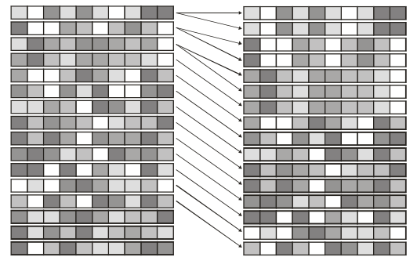
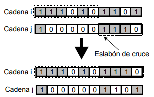
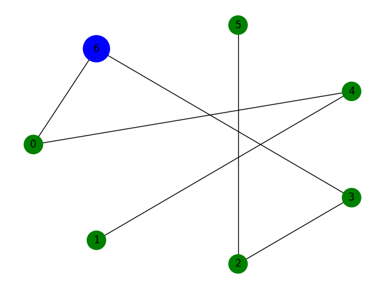
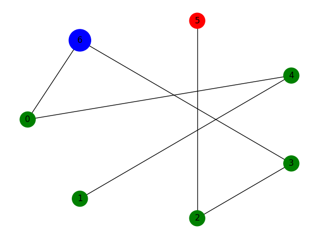
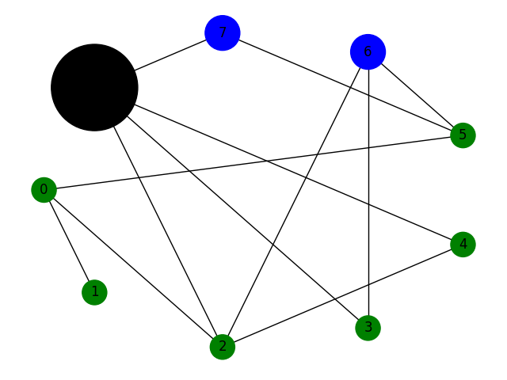
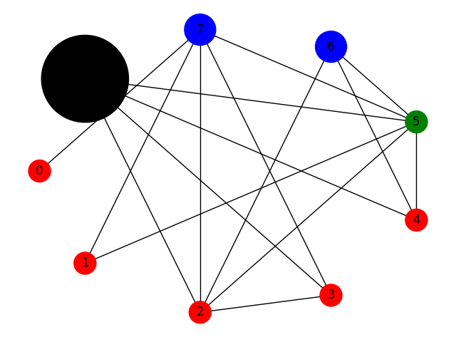

# Red de distribución de recursos. Red eléctrica


## Integrantes

- Jesús Santos Capote [@sheldon05](https://github.com/sheldon05)
- Kenny Villalobos [@KennyVillalobos](https://github.com/KennyVillalobos)
- Darío Fragas [@dfg-98](https://github.com/dfg-98)


## Introducción:

La construcción y mantenimiento de sistemas electroenergéticos constituye una problemática a optimizar en la actualidad.
¿Cómo diseñar una red eléctrica de forma que el desabastecimiento sea mínimo? ¿Cómo se puede optimizar el uso de los recursos? 
A estas dos interrogantes se pretende dar respuesta con este proyecto.

## Modelación:

La modelación de la red eléctrica se ha hecho mediante nodos que pueden ser del tipo `Consumidores`, `Generadores` o `Productores`.

Los nodos `Consumidores` son los que consumen energía de la red. Se definen dos tipos de nodos consumidores:

- `MinMaxConsumerNode`: su consumo está dado por una variable aleatoria uniforme entre un valor mínimo y un máximo.
- `TurnBasedConsumer`: consume por turnos, es decir tiene asociado un tiempo de consumo y un tiempo de espera. Durante el tiempo de consumo su consumo está dado por una variable aleatoria uniforme en una vecindad de un valor medio, durante el tiempo de espera no consume.

Los nodos `Consumidores` también generan recursos en forma proporcional a la energía consumida a modo de cobro de electricidad.

Los nodos `Generadores` son los que generan energía para la red. Tienen asociado una capacidad de generación máximo, una cantidad de recursos máxima, un costo de producción de energía y la cantidad de recursos actuales en el node para producir. Además tiene asociada una variable de salud que indica
una probabilidad de que no se genere electricidad en un momento dado. La salud se ve afectada por la cantidad de energía generado en un factor determinado como `generation_damage_rate`.

Los nodos `Productores` son los que producen recursos usados en la generación de energía y mantenimiento de la red. Tienen asociado una capacidad de producción máxima y un costo de energía para producir. Al igual que los generadores, presentan salud que indica la probabilidad de que se produzca o no y se ve afectada por la cantidad de recursos producidos en un factor determinado como `production_damage_rate`.
Los nodos `Productores` son a su vez `Consumidores` cuyo consumo está dado por la energía necesaria para producir sus recursos.

La red eléctrica está representada como un grafo cuyos vértices son estos nodos y las aristas representan las conexiones entre los nodos. Las aristas tienen asociado un costo de conexión y una salud que indica la probabilidad de que la conexión falle en un momento dado (no pase corriente por ahí). La salud se ve afectada por la cantidad de energía que pasa por la conexión en un factor determinado como `edge_damage_rate`.

Todos los elementos con salud pueden ser reparados usando recursos y tienen costos variables de reparación.


### Nodos consumidores

`MinMaxConsumerNode`:

- `min`: consumo mínimo del nodo
- `max`: consumo máximo del nodo

`TurnBasedConsumer`:

- `mean_consumption`: consumo promedio del nodo, el consumo estará dado por un valor uniforme en una vecindad de este valor de radio `DEFAULT_CONSUMPTION_BIAS`
- `on_turns`: número de rondas que estará consumiendo antes de cambiar su estado a descanso
- `off_turns`: número de turnos que estará descansando sin consumir hasta reactivarse

Los nodos consumidores tienen asociado un estado en dependencia de si fue satisfecha su demanda de consumo

```python
class Status(Enum):
        OFF = 0   # Al nodo no se le ha administrado energía
        PARTIAL = 2 # El nodo recibió energía pero no suficiente para satisfacer su demanda
        ON = 1 # La demanda del nodo fue satisfecha
```

Estos nodos tienen un método `feed` que toma como entrada la cantidad de energía que se le quiere suministrar, con este valor 
el nodo actualiza su estado y devuelve la energía sobrante.

Los nodos puramente consumidores producen recursos bajo la idea de "cobrar la electricidad". Para ello existe una variable global
`ELECTRICITY_PRICE` que indica el costo por consumir una unidad de energía.


En la visualización el nodo se dibuja en rojo si se encuentra en `OFF`, naranja si está `PARTIAL` y verde si está `ON`.


### Nodos generadores

`GeneratorNode`

- `max_generation`: capacidad máxima de generación.
- `generation_rate`: cantidad de recursos necesaria para producir una unidad de energía
- `generation_bias`: rango dentro del cual se obtendrá el valor de energía generada.
- `generation_damage_rate`: Cantidad de energía generada para producir un daño de una unidad a la salud del nodo.
- `resources`: recursos con que cuenta el nodo
- `max_resources`: máximo de recursos que puede almacenar el nodo
- `reparation_cost_rate`: cantidad de recursos necesarios para reparar la salud del nodo en una unidad

Para generar energía se expone un método que toma el valor de energía que se desea producir. Se comprueba si la salud del nodo 
va a permitir la generación, esto es, mediante una función de probabilidad cuadrática que favorece los valores pequeños comprobar que la salud del nodo es mayor.
En caso de producir se genera una valor con probabilidad uniforme en una vecindad del valor deseado de radio `generation_bias`, de este valor de generación deseado se genera lo que la salud y los recursos con que cuenta el nodo permitan. Se descuentan los recursos utilizados y se refleja el daño de producir dicha cantidad a la salud del nodo.

El nodo generador posea además métodos para reabastecer sus recursos y producir reparaciones.

Estos nodos se dibujan de azul en las visualizaciones.

### Nodos productores

`ResourceProducerNode`

- `max_resource_production`: cantidad máxima de recursos que puede producir el nodo.
- `resource_production_rate`: cantidad de energía necesaria para producir una unidad de recursos.
- `resource_production_bias`: rango en que fluctúa la producción.
- `production_damage_rate`: cantidad de recursos que al producirse reflejan un daño a la salud en una unidad.
- `reparation_cost_rate`: cantidad de recursos necesarios para reparar la salud del nodo en una unidad

Los nodos productores son a su vez consumidores, cuyo consumo está dado por la cantidad de recursos que va a producir multiplicado por `resource_production_rate`.

Se establece el valor de producción deseado como una variable aleatoria en una vecinadad del máximo de producción posible. Cuando el nodo es alimentado producirá recursos en función de la energía que se le proporcione hasta suplir el valor de producción establecido y mientras la salud del nodo lo permita.

En las visualizaciones estos nodos se representan en rosado si no se le ha suministrado energía, amarillo si está parcialimente alimentado y negro cuando está abastecido. Además
su tamaño será proporcional a la cantidad de recursos generados.


## Simulación:

Dada una red eléctrica la simulación de su comportamiento es la siguiente:

- Un agente se encarga de asignar recursos a los nodos generadores para la producción de energía.
- Cada nodo consumidor establece su consumo en el turnos
- Un agente determina que nodos y aristas reparar y qué recursos usar para ello.
- Un agente determina para cada nodo `Generador` la cantidad de energía que debería generar (la generación real puede verse afectado por las condiciones propias del generador como recursos disponibles, salud, etc).
- Se genera energía y se distribuye por la red alimentando cada nodo consumidor.
- Se recolectan los recursos generados.
- Se le asigna a una evaluación a la red basado en el abastecimiento y la salud de sus elementos.


## Inteligencia Artificial:

### Algoritmo Genético:

Los algoritmos genéticos hacen evolucionar una población de individuos sometiéndola a acciones aleatorias, semejantes a las que actúan en la evolución biológica (mutaciones y recombinaciones genéticas), así como también a una selección. De acuerdo con algún criterio, se decide cuáles son los individuos más adaptados, que sobreviven, y cuáles son los menos aptos, que son descartados [1].

En el proyecto se usa un algoritmo genético cuya población son redes eléctricas y su función de fitness está dada mediante la simulación, descrita en puntos anteriores, del comportamiento de la red en un entorno real y la evaluación de la misma.

Los cromosomas de las redes son la lista de adyacencia aplanada del grafo que representa a la red. Los parámetros del algoritmo son:

1. **$\beta$**: Parámetro que interviene en la fórmula de interpolación lineal que determina cuales de los individuos de la población serán duplicados, mantenidos o eliminados. Se explicará a profundidad este proceso más adelante. El valor de $\beta$ por defecto es $1.6$ como sugieren algunas bibliografías [2].
2. **mutation_prob**: Probabilidad de que un cromosoma de la nueva generación de redes sufra una mutación. Por defecto este parámetro es $0.001$ como sugieren algunas bibliografías [2].
3. **iter_number**: Número de iteraciones del algoritmo.
4. **population_lenght**: Número de individuos de las poblaciones.
5. **cost_matrix**: Matriz de costo de las conexiones entre los nodos de la red. Utilizada en la reconstrucción de las redes de la población a partir de sus cromosomas. El costo total de la red también es una métrica importante, tomada en cuenta por la simulación (función de fitness).
6. **get_fitness**: Función de fitness para evaluar las redes generadas. El valor otorgado por la simulación a las redes.

A continuación se describen las fases del AG empleado para la generación de poblaciones a partir de una población inicial de  redes, obtenida de forma aleatoria mediante el algoritmo Erdos-Renji presente en la biblioteca NetworkX. En cada iteración se dan los siguientes pasos:

1. Se calcula el valor de fitness a todas las redes de la población actual y se ordena la población de mayor a menor según el valor de fitness de los individuos.
2. Se compara el valor de fitness de la mejor red de la iteración actual con la mejor red hasta el momento, en caso de mejorar lo ya obtenido, se actualiza la mejor red hasta el momento.
3. Se realiza el proceso de **Reproducción**.
4. Se realiza el proceso de **Cruzamiento**.
5. Se realiza el proceso de **Mutación**.
6. Se sustituye la población anterior por la nueva generación.

Luego de realiar todas las iteraciones, la variable **best_network** almacenará la mejor red generada para el juego de parámetros dados.


#### Reproducción:

El proceso de reproducción consiste en seleccionar de entre la población, las redes más aptas para el cruzamiento, teniendo en cuenta el valor de fitness de los individuos. Se procede a calcular la probabilidad máxima de selección $p_{max}$ asociada a la red de mayor valor de fitness (red en la posición 0 del array de población luego de ser ordenado) y la probabilidad mínima de selección $p_{min}$ asociada a la red de menor valor de fitness (red en la última posición del array de población luego de ordenado). Ambas probabilidades están dadas por las fórmulas[2]:
$$p_{max} = \frac{\beta}{n}$$
$$p_{min} = \frac{2 - \beta}{n}$$
donde $n$ es la cantidad de individuos de la población actual.

Luego se pasa a calcular la probabilidad de selección para el resto de los individuos $p_{i}$ mediante interpolación lineal entre los valores extremos $p_{min}$ y $p_{max}$ utilizando la siguiente fórmula[2]:

$$p_{i} = p_{min} + (p_{max} - p_{min})\frac{n - (i + 1)}{n - 1}$$

donde $i$ representa la posición del individuo en el array de la población ordenado por el valor de fitness, de mayor a menor. Note que la fórmula anterior está ligada implícitamente al valor de fitness de los individuos pues depende de su posición en la población, la cual a su vez depende del valor de fitness del individuo.

Por último se determinan las redes que serán eliminadas, mantenidas y duplicadas en la población intermedia a la cual se le realizará el cruzamiento. Para ello se calcula por cada individuo:

$$p_{s} = p_{i} * n$$

Si dicho producto es mayor o igual que 1.5 la red se duplica, si está entre 0.5 y 1.5 la cadena se mantiene y si es inferior a 0.5 la cadena se elimina de la siguiente generación. La forma en que se calculan estos valores garantiza que se duplican tantas redes como se eliminan, por tanto el tamaño de la población se mantiene constante. Al duplicar las redes más aptas aumentamos sus probabilidades de ser escogidas en el proceso de cruzamiento. La siguiente figura ilustra el proceso de reproducción.

 


#### Cruzamiento:

En el proceso de cruzamiento se seleccionan parejas de la población intermedia, obtenida en el proceso de Reproducción, de forma aleatoria. Cada pareja seleccionada genera dos hijos. Se selecciona un gen de cruzamiento aleatoriamente en cada cruzamiento (una posición del array booleano que representa su cromosoma). Este gen particiona los cromosomas del padre 1 y padre 2 en dos partes, llamemoslas parte izquierda y parte derecha. El cromosoma del primer hijo está compuesto por la parte izquierda del padre 1 y la parte derecha del padre 2. El cromosoma del segundo hijo está compuesto por la parte izquierda del padre 2 y la parte derecha del padre 1. Se obtiene una nueva población de redes que mantienen y recombinan las características de los mejores individuos de la población anterior. Luego los cromosomas de esta nueva generación de individuos pasan al proceso de mutación. La siguiente figura ilustra el proceso de cruzamiento: 




#### Mutación:

En el proceso de mutación se seleccionan individuos para ser mutados, con una probabilidad de 0.001. Se genera una variable aleatoria que distribuye uniforme entre [0, 1] por cada individuo de la nueva población, si el valor de la variable aleatoria es menor que 0.001 dicho individuo es seleccionado para la mutación. A los individuos seleccionados se les cambia un gen de forma aleatoria.

Por último se reconstruye la nueva generación de redes a partir de sus cromosomas y esas redes pasan a ser la población actual para la próxima iteración del algoritmo.

Durante la simulación se tienen varios agentes inteligentes que se encargan de diferentes tareas:

- `ResourceAssigner`: se encarga de asignar recursos a los nodos generadores para la producción de energía.
- `GenarationEstimator`: se encarga de determinar para cada nodo `Generador` la cantidad de energía que debería generar.
- `ReparationAgent`: se encarga de determinar que nodos y aristas reparar y qué recursos usar para ello.

## Resultados:

Se estudiaron varios casos para comprobar nuestro modelo. A continuación se presentan los resultados.

### Caso 1:

Se estudia el caso de 6 nodos consumidores, 5 de ellos `MinMaxConsumer` y un `TurnBasedConsumer` y un nodo generador.

- MinMaxConsumer("min": 50, "max": 100)
- MinMaxConsumer("min": 50, "max": 100)
- MinMaxConsumer("min": 20, "max": 30)
- MinMaxConsumer("min": 20, "max": 30)
- MinMaxConsumer("min": 100, "max": 150)
- TurnBasedConsumer("mean_consumption": 500, "on_turns": 1, "off_turns": 3)
- Generator(
      "reparation_cost_rate": 10.0,
      "max_generation": 700,
      "generation_rate": 2.0,
      "max_resources": 1000,
      "generation_bias": 10.0,
      "generation_damage_rate": 100
    )

```python
[
    [np.inf, 1, 1, 1, 1, 1, 1, ],
    [1, np.inf, 1, 1, 1, 1, 1000, ],
    [1, 1, np.inf, 1, 1, 1, 1000, ],
    [1, 1, 1, np.inf, 1, 1, 1000, ],
    [1, 1, 1, 1, np.inf, 1, 1000, ],
    [1, 1, 1, 1, 1, np.inf, 1000, ],
    [1, 1000, 1000, 1000, 1000, 1000, np.inf, ]
]
```

En esta configuración el generador puede abastecer a toda la red en el mejor de los casos y provocaría déficet en casos donde no tuviese recursos suficientes. Además los costos de las conexiones del generador con el resto de los nodos es muy alta salvo para uno por lo que es de esperarse que
tenga una conexión con este nodo.

En la siguiente imagen vemos el resultado obtenido:



Aquí podemos ver como efectivamente hay una conexión del generador con el nodo `0` . Además la red es un camino con el nodo generador justo en el medio. Esta solución es bastante trivial y bastante buena aunque una mejor solución pudiese haber sido con el generador en un extremo.

Se ve además para el final de la simulación que los nodos más alejados terminan quedando desabastecidos


### Caso 2

Este caso se tienen dos generadores.
Los mismos nodos consumidores que el anterior y un nodo productor de recursos. Además los costos de las conexiones son iguales para todo par de nodos


- MinMaxConsumer("min": 50, "max": 100)
- MinMaxConsumer("min": 50, "max": 100)
- MinMaxConsumer("min": 20, "max": 30)
- MinMaxConsumer("min": 20, "max": 30)
- MinMaxConsumer("min": 100, "max": 150)
- TurnBasedConsumer("mean_consumption": 500, "on_turns": 1, "off_turns": 3)
- Generator(
      "reparation_cost_rate": 10.0,
      "max_generation": 700,
      "generation_rate": 2.0,
      "max_resources": 1000,
      "generation_bias": 10.0,
      "generation_damage_rate": 100
    )
- Generator(
      "reparation_cost_rate": 10.0,
      "max_generation": 300,
      "generation_rate": 0.25,
      "max_resources": 500,
      "generation_bias": 10.0,
      "generation_damage_rate": 100
    )
- ResourceProducer(
      "reparation_cost_rate": 10.0,
      "max_resource_production": 1000,
      "resource_production_rate": 10.0,
      "resource_production_bias": 10.0,
      "production_damage_rate": 100
    )

```python
[
    [np.inf, 1, 1, 1, 1, 1, 1, 1, 1],
    [1, np.inf, 1, 1, 1, 1, 1, 1, 1],
    [1, 1, np.inf, 1, 1, 1, 1, 1, 1],
    [1, 1, 1, np.inf, 1, 1, 1, 1, 1],
    [1, 1, 1, 1, np.inf, 1, 1, 1, 1],
    [1, 1, 1, 1, 1, np.inf, 1, 1, 1],
    [1, 1, 1, 1, 1, 1, np.inf, 1, 1],
    [1, 1, 1, 1, 1, 1, 1, np.inf, 1],
    [1, 1, 1, 1, 1, 1, 1, 1, np.inf],
]
```

Aquí es de esperarse que la red resultante tenga al nodo productor lo más cercano posible a un generador pues esto 
permitirá tener mayor cantidad de recursos para la generación.

Efectivamente el resultado obtenido nos da una conexión directa entre el generador más potente con el nodo productor.



Aunque en las etapas finales de la simulación los recursos que se
producen no son suficiente para mantener la red y los nodos más
alejados terminan quedando desabastecidos.



## Conclusiones:

Aunque la modelación del problema es bastante simple permite dar una idea de cómo se puede modelar un problema más complejo y cómo se puede usar la inteligencia artificial para resolverlo.
Con este proyecto se ha podido ver que la inteligencia artificial puede ser usada para resolver problemas de optimización y que es posible construir redes eléctricas que funcionen de forma eficiente.

## Referencias Bibliográficas:

1. [https://es.wikipedia.org/wiki/Algoritmo_gen%C3%A9tico]
2. [https://www.researchgate.net/publication/237276279_ALGORITMO_GENETICO_MODIFICADO_PARA_DISENO_DE_REDES_DE_ABASTECIMIENTO_DE_AGUA]
